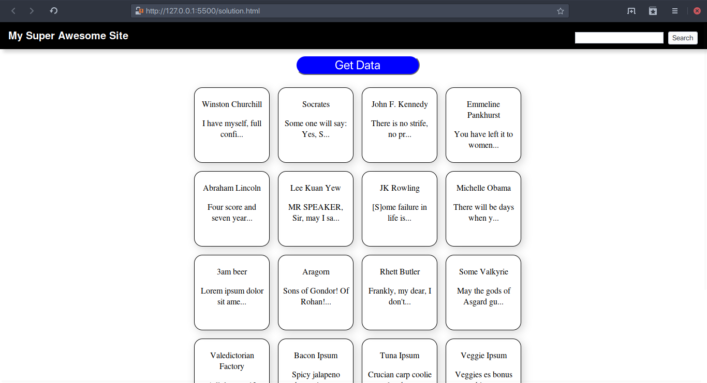

## Instructions
The goal is to create a page with a header that contains a search form and a button that fetches some data. When the user clicks on the button, data is fetched from a remote server, and cards are created that display snippets of data in the middle of the page. When the user enters something into the search form and clicks on the submit button, only cards that contain strings that match what the user enetered will show. Cards that do not contain such strings will be hidden.

Some boilerplate code has been written for you, but they may contain bug which you will have to fix.

## Example of Final Outcome

### Bonus
Make every alternate card have a gray background to give the aesthetic of a chessboard.

### Bonus
Make the cards clickable. When clicked on, a card should expand to show the rest of its text. When clicked on again, it should shrink back into its original state, displaying only the snippet again.

### Bonus
Instead of only showing the cards that contain strings that match what the user entered, highlight the part of the text that matches the user's input and some of its surrounding words.
